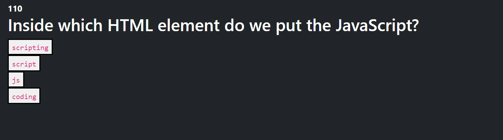

# JavaScript Timed Quiz

This test is designed for beginners. This test will prompt you with 3 questions testing your JavasScript knowledge. This app has scoreboard functionality using JavaScripts built in LocalStorage.

## Installation

N/A 

## Usage

Find deployed application here https://iskry.github.io/jsTimedQuiz/ 

## Contributing
Pull requests are welcome. For major changes, please open an issue first to discuss what you would like to change.

## License
[MIT](https://choosealicense.com/licenses/mit/)
